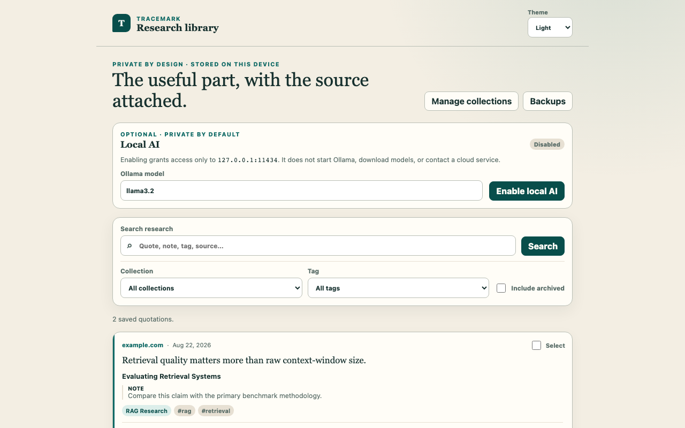

# TraceMark

> Save the useful part of the web — and keep the source attached.

TraceMark is a Chrome and Firefox extension for saving quotations with their source, organizing
them into a searchable research library, and marking an exact quotation on its original page.
Research stays local to the browser profile by default: TraceMark has no account, telemetry,
cloud sync, or application backend.



## What it does

- Captures selected text with the page title, source URL, and nearby text context.
- Organizes quotations with collections, tags, and notes.
- Searches saved quotation text, titles, source hosts, notes, tags, and collection names.
- Marks an exact saved quotation on its original page without changing the page text.
- Downloads complete JSON backups or readable Markdown exports.
- Optionally summarizes, explains, suggests tags for, or creates an overview of user-selected
  saved research through a local Ollama service.

## Install for local use

TraceMark 1.0.0 has validated Chrome and Firefox packages, but it is not published in either
browser store. Download the reviewed artifacts from the
[TraceMark v1.0.0 GitHub release](https://github.com/mateoosoriodelhonte/tracemark/releases/tag/v1.0.0):

- [Chrome package](https://github.com/mateoosoriodelhonte/tracemark/releases/download/v1.0.0/tracemark-1.0.0-chrome.zip)
- [Firefox package](https://github.com/mateoosoriodelhonte/tracemark/releases/download/v1.0.0/tracemark-1.0.0-firefox.zip)
- [SHA-256 checksums](https://github.com/mateoosoriodelhonte/tracemark/releases/download/v1.0.0/SHA256SUMS)

Verify the downloaded browser archive against `SHA256SUMS` before installation.

First install [Node.js 22 or newer](https://nodejs.org/) and pnpm 11.19.0, then build both browser
targets:

```sh
pnpm install --frozen-lockfile
pnpm build:chrome
pnpm build:firefox
```

### Chrome

1. Open `chrome://extensions`.
2. Enable **Developer mode**.
3. Choose **Load unpacked** and select `.output/chrome-mv3`.

Chrome documents this workflow in [Load an unpacked extension](https://developer.chrome.com/docs/extensions/get-started/tutorial/hello-world#load-unpacked).

### Firefox

The generated `.output/tracemark-1.0.0-firefox.zip` is unsigned. Normal permanent installation in
release or beta Firefox requires Mozilla signing, and its manifest requires Firefox 142.0 or newer;
see Mozilla's
[signing and distribution overview](https://extensionworkshop.com/documentation/publish/signing-and-distribution-overview/).

For development, open `about:debugging#/runtime/this-firefox`, choose **Load Temporary Add-on**,
and select `.output/firefox-mv3/manifest.json`. Firefox removes a temporary add-on when Firefox
restarts. See Mozilla's [temporary installation guide](https://extensionworkshop.com/documentation/develop/temporary-installation-in-firefox/).

## Use TraceMark

### Save a quotation

1. Select text on a normal webpage.
2. Click the TraceMark toolbar action, review the quotation and source, optionally choose a
   collection and add tags or a note, then choose **Save quotation**.
3. Alternatively, use **Save selection to TraceMark** in the selection context menu or press
   `Alt+Shift+S` to save directly to Inbox.

The toolbar, context-menu, and keyboard flows are browser gestures. They grant access only to the
active page for that invocation; TraceMark does not run a content script on every site.

### Search and edit

Open **TraceMark Research Library** in Chrome's side panel or Firefox's sidebar. Search across
saved text and metadata, narrow results by collection or tag, and choose **Edit** to change a
quotation's collection, tags, or note. Collections can be created, renamed, archived, restored,
or deleted; deleting a collection moves its quotations to Inbox.

### Mark a quotation on its source page

Open the saved source in a fresh or revisited tab, keep it active, and choose **Mark on page**. With
no current `activeTab` grant, TraceMark tells you to invoke its toolbar action or press
`Alt+Shift+S` on that tab and then retry **Mark on page**. TraceMark marks only an unambiguous exact
match. If the quote is missing, duplicated without enough context, or changed, TraceMark refuses to
guess. The mark is a runtime page annotation, not an edit to the website, and does not persist
after the page is reloaded. Browser-protected pages can remain unavailable even after a gesture.

### Back up and restore

Open **Backups** in the research library:

- **Download JSON backup** exports collections, quotations, saved local-AI results, and preferences
  in a format TraceMark can import.
- **Download Markdown** creates a readable export of all research, or of the currently filtered
  collection.
- **Validate and merge backup** validates a TraceMark JSON file before merging it with local data.

Downloads are the user's responsibility after TraceMark creates them. Store JSON backups somewhere
you trust and test your recovery process; TraceMark has no automatic cloud backup.

## Optional local AI with Ollama

Local AI is disabled by default. TraceMark never downloads or starts Ollama and never grants the
Ollama origin silently.

1. Install Ollama and pull the default model:

   ```sh
   ollama pull llama3.2
   ```

2. Make sure Ollama is running locally. `ollama serve` starts its server when another Ollama process
   is not already serving it.
3. In TraceMark's **Local AI** section, confirm the model name and choose **Enable local AI**.
4. Approve access to `http://127.0.0.1:11434/*` when the browser asks. Firefox uses two explicit
   steps: the first **Enable local AI** click requests optional website-content and browsing-activity
   data consent, then **Continue enabling local AI** requests the loopback origin with a second
   click. All applicable grants are required before TraceMark sends selected research to Ollama.
5. Select one or more saved quotations, then choose **Summarize**, **Explain**, **Suggest tags**, or
   **Overview**.

TraceMark sends only the stored fields of the highlights selected for that requested action:
internal highlight ID, quotation, title, source URL, tags, and note. Traffic uses plain HTTP on the
loopback interface; it is not encrypted. Ollama, installed models, and other software on the device
are separate components whose trustworthiness you must assess. See the
[Ollama API introduction](https://docs.ollama.com/api/introduction).

Disabling local AI first saves the disabled preference and then asks the browser to remove the
optional Ollama origin permission and, on Firefox, both optional data-consent types.
TraceMark rechecks both applicable grants before every request and fails closed if either was
revoked in browser settings. If permission cleanup fails, or a disabled library reloads with a
residual Local AI grant, TraceMark shows **Retry permission removal** and blocks re-enabling until
the user explicitly completes cleanup. If the browser permissions cannot be inspected, TraceMark
uses that same blocked retry state instead of assuming the grants are absent. It does not remove a
residual grant merely because the library loaded.

## Browser limitations

- Browser-internal pages, browser store pages, and browser-owned PDF viewers may reject capture or
  marking because extensions cannot inject into them.
- Capture and **Mark on page** require a qualifying user gesture and the source tab to be active.
- Changed or ambiguous quotation text is not marked automatically.
- Local data follows the browser profile. Clearing extension/site data, deleting a profile, or
  uninstalling the extension can make research unavailable; keep downloaded backups.
- The Chrome and Firefox stores do not currently list TraceMark. The Firefox ZIP is unsigned.

## Development

```sh
pnpm dev                 # Chrome development runner
pnpm dev:firefox         # Firefox development runner
pnpm build:chrome        # build .output/chrome-mv3
pnpm build:firefox       # build .output/firefox-mv3
pnpm package:build       # create Chrome and Firefox release ZIPs
pnpm screenshots         # regenerate deterministic store screenshots
pnpm screenshots:check   # validate screenshot filenames, dimensions, and sizes
pnpm check               # self-contained quality and release-package gate
```

From a clean checkout, `pnpm check` builds both exact release archives before running the ZIP
contract tests; release archives do not need to exist in advance.

For the full test matrix, packaged-browser evidence, and manual browser-gesture checklists, see
[Testing TraceMark](docs/TESTING.md). Contributors should also read [CONTRIBUTING.md](CONTRIBUTING.md).

## Privacy, permissions, and architecture

- [Privacy policy](PRIVACY.md)
- [Permission rationale](docs/PERMISSIONS.md)
- [Architecture and trust boundaries](docs/ARCHITECTURE.md)
- [Security policy](SECURITY.md)

## Project status

TraceMark 1.0.0 is published as a GitHub release. Chrome and Firefox archives validate, and
packaged-browser automation covers startup, import, library, search, edit, inert rendering, and
exports. Browser-chrome capture, fresh-tab anchor recovery, native panel/sidebar operation, and
Firefox permission prompts remain integration-tested plus documented manual checks. Browser-store
submission and publication have not occurred.

## License

TraceMark is available under the [MIT License](LICENSE).
